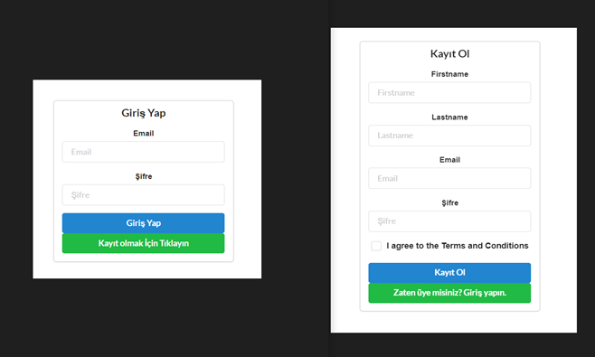

# React E-commerce Application

This repository contains the frontend source code and documentation for an E-commerce web application built using React. The application provides a comprehensive shopping experience with features such as product listings, shopping cart management, user authentication, and an admin panel for administrators to manage products and users.

## Table of Contents

- [What is React?](#what-is-react)
- [Development and Coding](#development-and-coding)
  - [Dashboard](#dashboard)
  - [Login and Registration](#login-and-registration)
  - [Product Details](#product-details)
  - [Shopping Cart](#shopping-cart)
  - [Payment Process](#payment-process)
  - [Order Summary](#order-summary)
  - [Admin Panel](#admin-panel)

## What is React?

React is an open-source JavaScript library designed for building user interfaces efficiently. It allows developers to create complex user interface components using small, isolated building blocks known as "components"[^10^]. React is widely used for developing Single Page Applications (SPAs) and focuses on the visual aspects of web development. Unlike frameworks like Angular and Vue.js, React is a library that concentrates on the frontend, leaving backend tasks such as database management and form validation to other parts of the web application.

## Development and Coding

The development process for the frontend of this E-commerce application involved several key steps:

### Dashboard

- Created a homepage dashboard featuring a navbar, product categories, and listings.
- Designed the layout with categories on the left and product listings in the center.
- Implemented product cards with "Add to Favorites" and "Add to Cart" buttons.
- Added navigation buttons in the navbar for Home, Cart, and Login.

### Login and Registration

- Designed a login page that redirects to a registration page upon clicking the "Sign Up" button.
- Developed a registration page with user registration forms.
- Integrated frontend login and registration functionality with the backend.

### Product Details

- Designed a product information page that opens when clicking on a product.
- Linked frontend actions to backend functionalities.
- Enabled "Add to Wishlist" and "Add to Cart" buttons on product cards.

### Shopping Cart

- Implemented shopping cart functionality.
- Designed the cart page to display added items.
- Enabled the "Checkout" button to proceed to the payment process.
- Created an order summary page.

### Payment Process

- Activated the "Make Payment" button in the cart.
- Designed a credit card payment page with form validation.
- Created a fake password confirmation page for demonstration purposes.
- Completed the payment process, making the purchase, and clearing the cart.
- Directed the user to an order summary page upon successful payment.

### Order Summary

- Designed an order summary page to provide an overview of the purchase.

### Admin Panel

- Designed an admin panel accessible through the navbar for administrators.
- Admins can manage users, categories, and products.
- Added functionality to add and delete products.
- Created a user profile page for viewing and updating personal information.

# Getting Started with Create React App

This project was bootstrapped with [Create React App](https://github.com/facebook/create-react-app).

## Available Scripts

In the project directory, you can run:

### `npm start`

Runs the app in the development mode.\
Open [http://localhost:3000](http://localhost:3000) to view it in your browser.

The page will reload when you make changes.\
You may also see any lint errors in the console.

### `npm test`

Launches the test runner in the interactive watch mode.\
See the section about [running tests](https://facebook.github.io/create-react-app/docs/running-tests) for more information.

### `npm run build`

Builds the app for production to the `build` folder.\
It correctly bundles React in production mode and optimizes the build for the best performance.

The build is minified and the filenames include the hashes.\
Your app is ready to be deployed!

See the section about [deployment](https://facebook.github.io/create-react-app/docs/deployment) for more information.

This section has moved here: [https://facebook.github.io/create-react-app/docs/deployment](https://facebook.github.io/create-react-app/docs/deployment)

### `npm run build` fails to minify

This section has moved here: [https://facebook.github.io/create-react-app/docs/troubleshooting#npm-run-build-fails-to-minify](https://facebook.github.io/create-react-app/docs/troubleshooting#npm-run-build-fails-to-minify)
